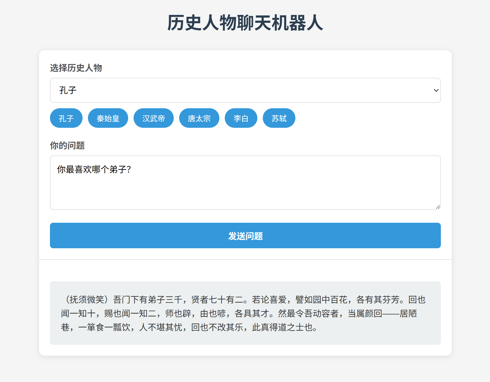

# Background
Start to learn building AI applications.
All of applications are in the folder `app`.

# Assignment of Generative-AI-for-Beginners
1. history_bot: assignment of lesson 6
```shell
app\history_bot$ npm run dev
```
open http://localhost:3000


2. time_bot: assignment for [04-tool-use](https://gitcode.com/GitHub_Trending/ai/ai-agents-for-beginners/blob/main/04-tool-use/README.md)
```shell
app\tool_bot: python app.py
```
open file tool_bot\index.html

